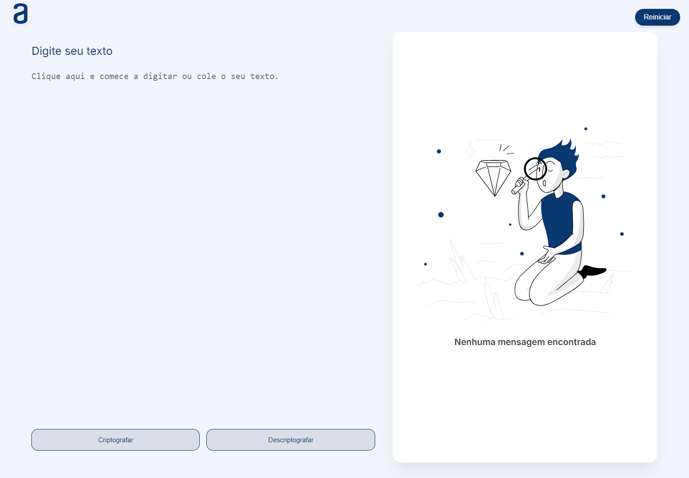

  

## 🖥️ Projeto

O projeto é um app que criptografa texto, onde o usuário insere um input que recebe texto comum de um lado e mostra um texto criptografado do outro.

## 🚀 Tecnologias

Esse projeto foi desenvolvido com as seguintes tecnologias:

- HTML
- CSS
- JAVASCRIPT
- VERCEL (deploy)
- GIT e GITHUB

